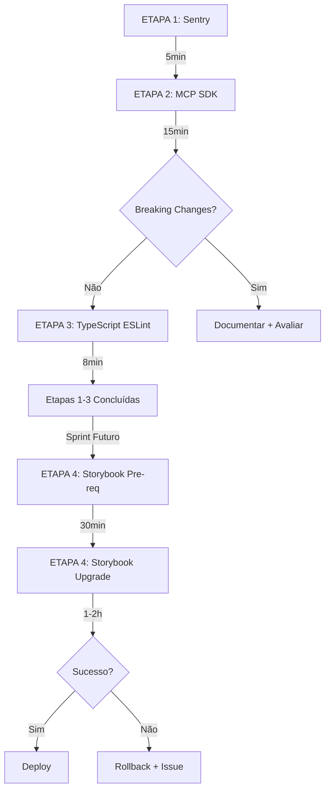

# Plano de Atualização de Dependências

**Versão**: 1.0  
**Data**: 18 de dezembro de 2025  
**Status**: Aguardando execução  
**Responsável**: DevOps Agent  

---

## 📋 Contexto

Após auditoria de dependências realizada em 17/12/2025, foram identificadas 4 categorias de atualizações pendentes:

1. **@sentry/nextjs** (10.28.0 → 10.31.0) - Patch releases, baixo risco
2. **@modelcontextprotocol/sdk** (1.0.0 → 1.25.1) - Minor releases, médio risco, requer teste de breaking
3. **TypeScript ESLint** (8.14.0 → 8.50.0) - Patches, baixo risco
4. **Storybook** (8.x → 10.x) - MAJOR upgrade, alto risco, requer planejamento dedicado

### Mapeamento de Uso

| Dependência | Local | Versão Atual | Versão Alvo |
|-------------|-------|--------------|-------------|
| @sentry/nextjs | workspace raiz | ^10.28.0 | ^10.31.0 |
| @modelcontextprotocol/sdk | workspace raiz | ^1.0.0 | ^1.25.1 |
| @typescript-eslint/* | packages/eslint-config | ^8.14.0 | ^8.50.0 |
| @storybook/* | domains/storybook | ^8.4.7 / ^8.6.14 | ^10.x (futuro) |
| @storybook/* | packages/design-system | ^8.4.7 / ^8.6.14 | ^10.x (futuro) |

### Análise de Risco

- ✅ **Baixo risco**: Sentry (3 patches), TypeScript ESLint (36 patches, mesma versão major)
- ⚠️ **Médio risco**: MCP SDK (25 minor releases, possível breaking)
- ⛔ **Alto risco**: Storybook (MAJOR 8→10, versões misturadas, addons, visual regression)

---

## 🎯 Objetivos

1. Manter dependências atualizadas para segurança e performance
2. Eliminar versões misturadas (especialmente Storybook 8.4.7 vs 8.6.14)
3. Testar breaking changes de forma controlada antes de aplicar em produção
4. Documentar decisões e validações para rastreabilidade futura

---

## 📦 ETAPA 1: Atualização Sentry

**Prioridade**: Alta  
**Risco**: Baixo  
**Tempo estimado**: 5 minutos  
**Bloqueadores**: Nenhum  

### 1.1 Contexto

O Sentry está no workspace raiz e monitora erros em Next.js. Atualização de 3 patch releases (10.28 → 10.31) é conservadora e focada em bugfixes.

### 1.2 Comandos

```bash
# Navegar para workspace raiz
cd c:\Users\Educacross\Documents\Ambiente-de-prototipa-o-EDUCACROSS-V2

# Atualizar Sentry
pnpm add @sentry/nextjs@^10.31.0

# Instalar dependências
pnpm install

# Validar build
pnpm build
```

### 1.3 Validações

- [ ] `pnpm install` completa sem erros de peer dependency
- [ ] `pnpm build` executa sem erros de TypeScript ou build
- [ ] Logs não mostram warnings de deprecação do Sentry
- [ ] Arquivos modificados: `package.json`, `pnpm-lock.yaml`

### 1.4 Commit

```bash
git add package.json pnpm-lock.yaml
git commit -m "chore(deps): atualizar @sentry/nextjs 10.28.0 → 10.31.0

- Atualização de patch releases (bugfixes e melhorias)
- Validado: build completo sem erros
- Impacto: zero breaking changes"
git push origin main
```

### 1.5 Rollback (se necessário)

```bash
pnpm add @sentry/nextjs@^10.28.0
pnpm install
git checkout -- package.json pnpm-lock.yaml
```

---

## 🔬 ETAPA 2: MCP SDK (com teste de breaking)

**Prioridade**: Alta  
**Risco**: Médio  
**Tempo estimado**: 15 minutos  
**Bloqueadores**: Etapa 1 concluída  

### 2.1 Contexto

O MCP SDK está no workspace raiz (uso geral para integrações futuras).

Salto de **1.0.0 → 1.25.1** (25 minor releases) pode conter breaking changes não documentados ou mudanças em APIs experimentais.

⚠️ **NOTA**: O subsistema code-to-figma foi removido do monorepo, então esta atualização agora afeta apenas o workspace raiz.

### 2.2 Estratégia

1. Criar branch de teste isolado
2. Atualizar no workspace raiz
3. Inspecionar changelog oficial
4. Verificar se há uso ativo do SDK no código
5. Validar build e type-check
6. Decidir: merge ou reverter

### 2.3 Comandos

```bash
# Criar branch de teste
git checkout -b test/mcp-sdk-update

# Atualizar workspace raiz
pnpm add @modelcontextprotocol/sdk@latest

# Instalar
pnpm install

# Inspecionar changelog
# URL: https://github.com/modelcontextprotocol/typescript-sdk/releases
```

### 2.4 Análise de Breaking Changes

```bash
# Buscar imports no código (workspace raiz e apps/packages)
grep -r "from '@modelcontextprotocol/sdk'" apps/ packages/ domains/

# Buscar exports/tipos usados
grep -r "import {" apps/ packages/ domains/ | grep modelcontextprotocol
```

**Pontos críticos para verificar**:
- Mudanças em `Server` class constructor
- Alterações em tool registration API
- Novos tipos obrigatórios em tool definitions
- Deprecation de métodos antigos

### 2.5 Validações

```bash
# Build completo
pnpm build

# Type check global
pnpm type-check

# Lint (verificar se há warnings de deprecação)
pnpm lint
```

**Checklist**:
- [ ] Build sem erros TypeScript
- [ ] Type-check passa sem erros
- [ ] Lint sem novos warnings
- [ ] Nenhum import órfão do SDK no código

### 2.6 Decisão

**✅ Se tudo OK (merge)**:
```bash
git checkout main
git merge test/mcp-sdk-update
git branch -d test/mcp-sdk-update

git add -A
git commit -m "feat(deps): atualizar @modelcontextprotocol/sdk 1.0.0 → 1.25.1

- Atualizado em workspace raiz
- Validado: build + type-check + lint passando
- Nota: code-to-figma removido do monorepo
- Breaking changes: nenhum detectado"
git push origin main
```

**❌ Se breaking detectado (reverter + documentar)**:
```bash
git checkout main
git branch -D test/mcp-sdk-update

# Criar issue no GitHub
# Título: "[Bloqueio] MCP SDK 1.0→1.25 contém breaking changes"
# Labels: dependencies, blocked
# Descrever: incompatibilidades encontradas, custo de adaptação, decisão
```

### 2.7 Rollback

```bash
# Se já fez merge e detectou problemas
git revert HEAD
pnpm install
pnpm build
```

---

## 🔧 ETAPA 3: TypeScript ESLint Patches

**Prioridade**: Média  
**Risco**: Baixo  
**Tempo estimado**: 8 minutos  
**Bloqueadores**: Etapas 1 e 2 concluídas  

### 3.1 Contexto

ESLint TypeScript está em `packages/eslint-config`: **v8.14.0** (usado no monorepo) → atualizar para **v8.50.0**

**Decisão**: atualizar 36 patch releases, baixo risco.

### 3.2 Comandos

```bash
# Atualizar no workspace eslint-config
pnpm --filter @prototipo/eslint-config add -D \
  @typescript-eslint/eslint-plugin@^8.50.0 \
  @typescript-eslint/parser@^8.50.0

# Instalar
pnpm install

# Rodar lint em todo monorepo
pnpm lint
```

### 3.3 Validações

- [ ] `pnpm lint` executa sem novos erros
- [ ] Nenhuma nova regra quebra código existente
- [ ] Build completo sem warnings ESLint
- [ ] `pnpm type-check` passa sem erros

**Verificar logs**:
- Novos warnings podem indicar regras mais rigorosas
- Se aparecerem, avaliar: fixar código ou ajustar config

### 3.4 Ajuste de Regras (se necessário)

Se o lint quebrar por novas regras:

```typescript
// packages/eslint-config/library.js ou base.js
module.exports = {
  rules: {
    // Desabilitar nova regra temporariamente
    '@typescript-eslint/nova-regra-problematica': 'warn', // ou 'off'
  },
};
```

### 3.5 Commit

```bash
git add packages/eslint-config/package.json pnpm-lock.yaml

git commit -m "chore(lint): atualizar TypeScript ESLint 8.14.0 → 8.50.0

- Atualizado @typescript-eslint/eslint-plugin e parser
- Escopo: packages/eslint-config
- Validado: pnpm lint sem novos erros
- Impacto: 36 patch releases aplicadas"

git push origin main
```

### 3.6 Rollback

```bash
pnpm --filter @prototipo/eslint-config add -D \
  @typescript-eslint/eslint-plugin@^8.14.0 \
  @typescript-eslint/parser@^8.14.0

pnpm install
git checkout -- packages/eslint-config/package.json pnpm-lock.yaml
```

---

## 🎨 ETAPA 4: Storybook 8.x → 10.x (MAJOR)

**Prioridade**: Baixa  
**Risco**: Alto  
**Tempo estimado**: 1-2 horas  
**Bloqueadores**: Requer sessão dedicada em sprint futuro  
**Status**: 🚧 PLANEJAMENTO - NÃO EXECUTAR AGORA  

### 4.1 Contexto

Storybook está com **versões misturadas** em 2 locais:

| Local | Versões | Status |
|-------|---------|--------|
| domains/storybook | 8.4.7 (maioria) + 8.6.14 (a11y) | ⚠️ Inconsistente |
| packages/design-system | 8.4.7 (react) + 8.6.14 (types) | ⚠️ Inconsistente |

**Desafio**: upgrade MAJOR (8→10) em cima de base inconsistente = alto risco de regressão visual e funcional.

### 4.2 Pré-requisitos (antes de começar)

#### 4.2.1 Unificar versão 8.x atual

```bash
# Atualizar TODAS para 8.6.14 (última 8.x estável)
pnpm --filter storybook add -D \
  @storybook/addon-essentials@^8.6.14 \
  @storybook/addon-interactions@^8.6.14 \
  @storybook/addon-links@^8.6.14 \
  @storybook/addon-onboarding@^8.6.14 \
  @storybook/blocks@^8.6.14 \
  @storybook/react@^8.6.14 \
  @storybook/react-vite@^8.6.14 \
  @storybook/test@^8.6.14 \
  storybook@^8.6.14

pnpm --filter @prototipo/design-system add -D \
  @storybook/react@^8.6.14 \
  @storybook/types@^8.6.14

pnpm install
pnpm dev:hub  # Testar se tudo funciona na 8.6.14 unificada
```

**Validação pré-upgrade**:
- [ ] Dev server inicia sem erros
- [ ] Todas as stories renderizam corretamente
- [ ] Addon a11y funciona
- [ ] Interaction tests rodam via `pnpm test-storybook`

#### 4.2.2 Documentar estado atual

```bash
# Criar backup de stories críticas
mkdir -p .storybook-backup
cp -r domains/storybook/src/stories/*.stories.tsx .storybook-backup/
cp domains/storybook/.storybook/main.ts .storybook-backup/
cp domains/storybook/.storybook/preview.ts .storybook-backup/

# Tirar screenshots das stories principais
# (manual ou via Chromatic)
```

#### 4.2.3 Ler documentação oficial

**Links obrigatórios**:
- Migration guide: https://storybook.js.org/docs/migration-guide
- Breaking changes 9.0: https://github.com/storybookjs/storybook/blob/next/MIGRATION.md#from-version-8x-to-90
- Breaking changes 10.0: https://github.com/storybookjs/storybook/blob/next/MIGRATION.md#from-version-9x-to-100

**Pontos críticos documentados**:
- Mudanças em framework API (React)
- Alterações em addons (a11y, interactions)
- Nova estrutura de configuração
- Deprecação de decorators/parameters antigos

### 4.3 Estratégia de Upgrade

#### 4.3.1 Criar branch isolado

```bash
git checkout -b feat/storybook-10-upgrade
```

#### 4.3.2 Atualizar via CLI oficial

```bash
# Storybook tem CLI de upgrade automático
pnpm dlx storybook@latest upgrade

# CLI vai:
# 1. Detectar versão atual
# 2. Aplicar codemods automáticos
# 3. Atualizar package.json
# 4. Executar migrations
```

**⚠️ Importante**: CLI pode perguntar confirmações, ler com atenção antes de aceitar.

#### 4.3.3 Atualizar packages incompatíveis manualmente

```bash
# Verificar compatibilidade de addons auxiliares
pnpm outdated @storybook/test-runner
pnpm outdated @chromatic-com/storybook

# Atualizar se necessário
pnpm --filter storybook add -D @storybook/test-runner@latest
pnpm --filter storybook add -D @chromatic-com/storybook@latest
```

#### 4.3.4 Ajustar configurações (se necessário)

Possíveis mudanças em `.storybook/main.ts`:

```typescript
// ANTES (v8)
export default {
  framework: '@storybook/react-vite',
  stories: ['../src/**/*.stories.@(js|jsx|ts|tsx)'],
  addons: ['@storybook/addon-essentials'],
};

// DEPOIS (v10 - exemplo hipotético, verificar docs)
export default {
  framework: {
    name: '@storybook/react-vite',
    options: {},
  },
  stories: ['../src/**/*.stories.@(js|jsx|ts|tsx)'],
  addons: ['@storybook/addon-essentials'],
};
```

#### 4.3.5 Atualizar imports em stories

Verificar breaking changes em imports:

```bash
# Buscar imports antigos
grep -r "@storybook/react" domains/storybook/src/stories/
grep -r "@storybook/testing-library" domains/storybook/src/stories/

# Exemplo de mudança (hipotético)
# ANTES: import { Meta, StoryObj } from '@storybook/react';
# DEPOIS: import type { Meta, StoryObj } from '@storybook/react';
```

### 4.4 Validações (critical path)

#### 4.4.1 Dev server

```bash
pnpm dev:hub
```

**Checklist**:
- [ ] Server inicia sem erros (porta 6006)
- [ ] Interface carrega sem crash
- [ ] Sidebar mostra todas as stories
- [ ] Stories individuais renderizam corretamente

#### 4.4.2 Build

```bash
pnpm build:hub
```

**Checklist**:
- [ ] Build completa sem erros
- [ ] Saída em `domains/storybook/storybook-static`
- [ ] HTML estático funcional (abrir index.html no browser)

#### 4.4.3 Visual regression

**Opção 1: Chromatic (automático)**
```bash
# Se tiver Chromatic configurado
pnpm chromatic --project-token=<token>
```

**Opção 2: Manual**
- Abrir stories críticas (DataTable, Badge, StatsCard, Button)
- Comparar com screenshots do backup
- Verificar cores, spacing, tipografia, estados interativos

#### 4.4.4 Interaction tests

```bash
pnpm --filter storybook test-storybook
```

**Checklist**:
- [ ] Todos os testes passam
- [ ] Coverage mantém thresholds
- [ ] Sem erros de timeout ou seletores quebrados

#### 4.4.5 Addon a11y

- Abrir story com addon a11y ativo
- Verificar painel "Accessibility" aparece
- Rodar scan (botão "Run tests")
- Confirmar que WCAG 2.1 AA checks funcionam

### 4.5 Riscos Conhecidos

| Risco | Probabilidade | Impacto | Mitigação |
|-------|---------------|---------|-----------|
| Breaking changes em addons | Alta | Alto | Ler changelogs, testar addon a11y primeiro |
| Mudanças em framework API | Média | Alto | Seguir migration guide oficial |
| Incompatibilidade com Vite 6 | Baixa | Médio | Storybook 10 suporta Vite 6, mas testar |
| Stories quebram por decorator changes | Média | Médio | Backup stories, testar uma por uma |
| Visual regression não detectada | Média | Alto | Screenshots manuais + Chromatic |
| Performance degradation | Baixa | Baixo | Medir tempo de build antes/depois |

### 4.6 Rollback Plan

#### Opção A: Reverter branch (recomendado)

```bash
git checkout main
git branch -D feat/storybook-10-upgrade

# Estado volta para Storybook 8.6.14 unificado
```

#### Opção B: Reverter commits específicos

```bash
git log --oneline  # Identificar commits do upgrade
git revert <commit-hash-1> <commit-hash-2>
pnpm install
pnpm dev:hub
```

### 4.7 Decisão Executiva

**Reavaliar após 1 hora de trabalho**:

- ✅ **Se >80% stories OK** → continuar e fixar edge cases
- ⚠️ **Se 50-80% stories OK** → pausar, abrir issue com problemas, agendar sessão 2
- ❌ **Se <50% stories OK** → rollback imediato, documentar blockers, avaliar manter 8.x

**Tempo máximo de tentativa**: 2 horas

### 4.8 Nota sobre subsistemas removidos

**ℹ️ INFORMAÇÃO**: O subsistema `code-to-figma` (figma-mcp-server + figma-sync-engine) foi removido do monorepo em 18/12/2025.

**Impacto no upgrade Storybook**:
- ✅ Não há mais conflito com Storybook 7.x legado
- ✅ Upgrade pode focar 100% em domains/storybook + packages/design-system
- ✅ Sem necessidade de compatibilidade com addons antigos

### 4.9 Commit Final (se sucesso)

```bash
git add -A
git commit -m "feat(storybook): atualizar 8.6.14 → 10.x

BREAKING CHANGES:
- Framework API atualizado para novo formato
- Addons migrados: a11y, interactions, essentials
- Stories ajustadas: [listar mudanças específicas]

Validações:
- ✅ Dev server: pnpm dev:hub funcional
- ✅ Build: pnpm build:hub completo
- ✅ Visual regression: 100% stories OK
- ✅ Interaction tests: todos passando
- ✅ Addon a11y: funcional e validado

Performance:
- Build time: [X]s antes → [Y]s depois
- Dev server start: [X]s antes → [Y]s depois

Escopo:
- domains/storybook: atualizado
- packages/design-system: atualizado"

git push origin feat/storybook-10-upgrade

# Criar PR para revisão
gh pr create --title "feat(storybook): atualizar 8.6.14 → 10.x" \
  --body "Ver commit message para detalhes completos" \
  --base main
```

---

## 📊 Timeline e Dependências



**Total estimado**:
- Etapas 1-3: **28 minutos** (execução imediata)
- Etapa 4: **2-2.5 horas** (sprint futuro, sessão dedicada)

---

## ✅ Critérios de Sucesso Global

### Para Etapas 1-3 (imediato)

- [ ] Zero erros de build: `pnpm build`
- [ ] Zero falhas de tipo: `pnpm type-check`
- [ ] Zero regressões de lint: `pnpm lint`
- [ ] Dev servers funcionais: `pnpm dev:studio` + `pnpm dev:admin`
- [ ] 3 commits limpos no histórico do Git
- [ ] Documentação de decisões (especialmente MCP SDK)

### Para Etapa 4 (futuro)

- [ ] 100% stories renderizando sem erros visuais
- [ ] 100% interaction tests passando
- [ ] Addon a11y funcional
- [ ] Build Storybook completo sem warnings críticos
- [ ] Performance mantida ou melhorada
- [ ] Branch mergeado ou rollback documentado

---

## 📝 Tracking de Execução

### Status por Etapa

| Etapa | Status | Data Execução | Commit SHA | Notas |
|-------|--------|---------------|------------|-------|
| 1. Sentry | ⏳ Pendente | - | - | Aguardando início |
| 2. MCP SDK | ⏳ Pendente | - | - | Depende de Etapa 1 |
| 3. TypeScript ESLint | ⏳ Pendente | - | - | Depende de Etapas 1-2 |
| 4. Storybook | 🚧 Planejado | - | - | Sprint futuro |

### Log de Execução

**Instruções**: Atualizar esta seção após cada etapa concluída.

```
[18/12/2025 - 00:00] - Plano criado, aguardando aprovação
[__/12/2025 - __:__] - ETAPA 1 iniciada
[__/12/2025 - __:__] - ETAPA 1 concluída - Commit: <sha>
[__/12/2025 - __:__] - ETAPA 2 iniciada
[__/12/2025 - __:__] - ETAPA 2 concluída - Commit: <sha> - Breaking: Sim/Não
[__/12/2025 - __:__] - ETAPA 3 iniciada
[__/12/2025 - __:__] - ETAPA 3 concluída - Commit: <sha>
[__/12/2025 - __:__] - Etapas 1-3 finalizadas com sucesso
[__/12/2025 - __:__] - ETAPA 4 agendada para sprint [número]
```

---

## 🔄 Próximos Passos

**Imediato** (hoje/agora):
1. Revisar este plano com equipe
2. Confirmar aprovação para execução
3. Executar Etapa 1 (Sentry) - 5 min

**Curto prazo** (hoje/amanhã):
1. Executar Etapa 2 (MCP SDK) - 15 min
2. Avaliar breaking changes (se houver)
3. Executar Etapa 3 (TypeScript ESLint) - 8 min
4. Validar estado final do monorepo

**Médio prazo** (próximo sprint):
1. Criar issue no GitHub: "feat(storybook): planejar upgrade 8.x → 10.x"
2. Agendar sessão de 2h dedicada para Etapa 4
3. Executar pré-requisitos (unificar 8.6.14)
4. Executar upgrade completo com validação

---

## 📚 Referências

- [Next.js Security Advisories](https://github.com/vercel/next.js/security/advisories)
- [Sentry Next.js Changelog](https://github.com/getsentry/sentry-javascript/blob/develop/CHANGELOG.md)
- [MCP TypeScript SDK Releases](https://github.com/modelcontextprotocol/typescript-sdk/releases)
- [TypeScript ESLint Releases](https://github.com/typescript-eslint/typescript-eslint/releases)
- [Storybook Migration Guide](https://storybook.js.org/docs/migration-guide)
- [Storybook 9.0 Breaking Changes](https://github.com/storybookjs/storybook/blob/next/MIGRATION.md#from-version-8x-to-90)
- [Storybook 10.0 Breaking Changes](https://github.com/storybookjs/storybook/blob/next/MIGRATION.md#from-version-9x-to-100)

---

## 📞 Contato e Suporte

**Responsável**: DevOps Agent  
**Revisão**: Fabio (fabioaap)  
**Repositório**: Ambiente-de-prototipa-o-EDUCACROSS-V2  

**Em caso de bloqueios**:
1. Parar execução imediatamente
2. Documentar erro completo (logs, stack trace, contexto)
3. Criar issue no GitHub com label `dependencies` + `blocked`
4. Notificar equipe via PR ou comentário

---

**Última atualização**: 18 de dezembro de 2025  
**Versão do plano**: 1.0  
**Status geral**: 📋 Documentado e pronto para execução
