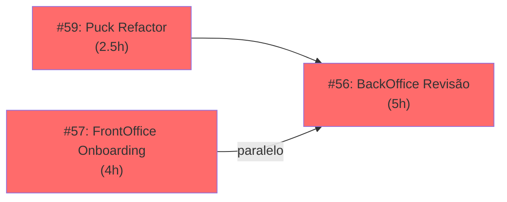
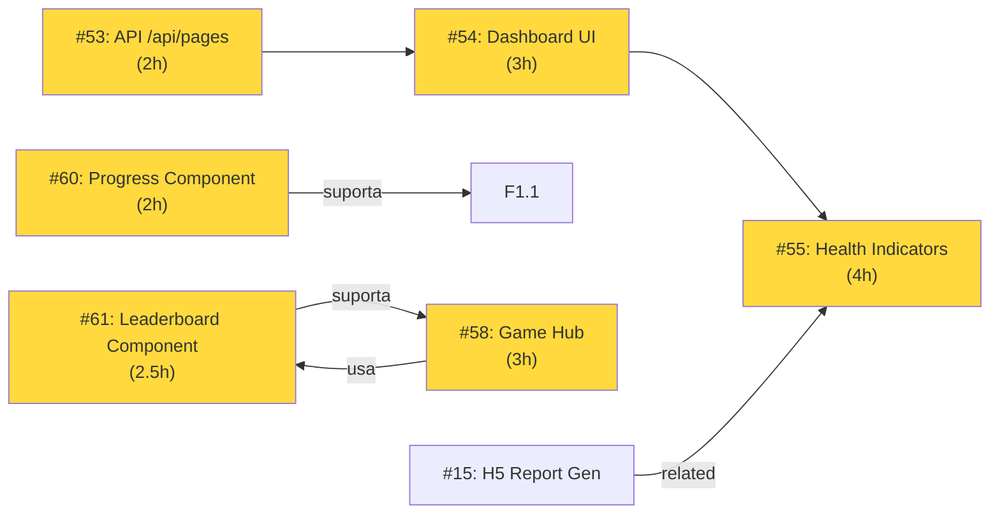

# 📋 Mapa Consolidado de Issues & Sequência de Execução
**Data**: 2025-11-23 | **Total de Issues Abertas**: 14

---

## 🎯 Resumo Executivo

| Prioridade | Abertas | Categoria | Status |
|-----------|---------|-----------|--------|
| **P1** | 4 | Features Críticas | 🔥 Iniciar AGORA |
| **P2** | 10 | Sprint 3 & Componentes | ⏳ Próximas |
| **Total** | 14 | | |

---

## 📍 ROADMAP DE EXECUÇÃO

### 🔥 PRIORIDADE 1 (Iniciar Imediatamente)



#### Issue #59: I1.1 - Puck Refactor (2.5h)
- **Escopo**: Refatorar `puck.config.tsx`, DropZone support
- **Bloqueador de**: #53, #54, #55 (Dashboard)
- **Tags**: `priority:P1` `type:task` `tooling`

#### Issue #57: F1.1 - FrontOffice Onboarding (4h)
- **Escopo**: Prototipação de fluxo de cadastro (5 telas)
- **Independente**: Pode rodar em paralelo
- **Tags**: `priority:P1` `type:task` `domain:FrontOffice`

#### Issue #56: E1.1 - BackOffice Revisão (5h)
- **Escopo**: Jornada de revisão de questões (3 telas)
- **Dependência indireta**: #59 (Puck) seria útil
- **Tags**: `priority:P1` `type:task` `domain:BackOffice`

---

### 📊 PRIORIDADE 2 (Sprint 3 - Dashboard & Componentes)



#### Caminho 1: Dashboard (Sequencial)
1. **#53** (2h): Implementar GET `/api/pages` endpoint
2. **#54** (3h): Dashboard UI (lista, filtros, links)
3. **#55** (4h): Health indicators (build, lint, metrics)

#### Caminho 2: Componentes (Paralelo)
- **#60** (2h): Progress component → usado por #57
- **#61** (2.5h): Leaderboard component → usado por #58

#### Caminho 3: Game Hub
- **#58** (3h): Game Hub prototipação (depende #61)

#### Issues Relacionadas (Manter em vista)
- **#15**: H5 - Report Generator (parte de Dashboard)
- **#14**, **#13**: H3, H2 - Versões antigas (considerar deprecar?)
- **#11**: Epic Dashboard (container de H1-H5)
- **#4**: E1 Epic (BackOffice geral)

---

## 📅 PLANO SEMANAL (Recomendado)

### Semana 1 (23-27 Nov)
```
Seg-Ter (P1 Critical)
├─ #59: Puck Refactor (2.5h) — blocker
├─ #57: FrontOffice Onboarding (4h) — paralelo
└─ #56: BackOffice Revisão (5h) — paralelo

Qua-Qui (P2 Dashboard Foundation)
├─ #53: API endpoint (2h)
├─ #54: Dashboard UI (3h)
└─ #60: Progress component (2h) — suporte

Sex (P2 Wrapping)
├─ #55: Health indicators (4h)
└─ #58: Game Hub (3h)
```

**Esforço Estimado**: ~31 horas (4 devs x 5 dias = ~1.5 sprints)

---

## 🏷️ ESTRUTURA DE LABELS

```
Prioridade:       priority:P1 (urgente) | priority:P2 (próximo)
Tipo:             type:task | (type:feature | type:bug já existem)
Domínio:          domain:BackOffice | domain:FrontOffice | domain:Game
Status:           status:backlog (padrão) | status:in-progress | status:done
Transversal:      tooling (infra/devops) | documentation
```

### Sequência Sugerida (Dependências)
```
Blocker: #59 (Puck)
  ↓
P1.2: #53 → #54 → #55 (Dashboard sequencial)
P1.3: #60 (Progress) → #57 (Onboarding)
P1.4: #61 (Leaderboard) → #58 (Game)
P1.5: #56 (BackOffice) — independente, fazer em paralelo
```

---

## ✅ Checklist de Execução

Quando começar uma issue:
- [ ] Mover para `status:in-progress`
- [ ] Self-assign (se agente)
- [ ] Verificar bloqueadores
- [ ] Revisar acceptance criteria
- [ ] Linkar PRs quando abrir

Quando terminar:
- [ ] PR criada e linkada
- [ ] Testes adicionados/atualizados
- [ ] Documentação atualizada
- [ ] Code review completado
- [ ] Merge e fechar issue

---

## 🚨 Observações Importantes

1. **Issues Duplicadas**: #14, #13, #15 parecem ser versões antigas de #11 (Epic Dashboard). Considerar consolidar.
2. **Epic #4 (E1)**: Espera prototipação real no Studio. Pode começar quando #59 resolver.
3. **Componentes**: #60 e #61 devem ter stories no Storybook ANTES de usar em jornadas.
4. **Testes**: Todas as P1 devem ter testes automatizados (unitários no mínimo).

---

## 📝 Como Usar Este Documento

- **Devs**: Seguir ordem de prioridade, verificar bloqueadores
- **PM**: Tracker de progresso semanal
- **Agentes**: Referência para automação e sequenciamento
