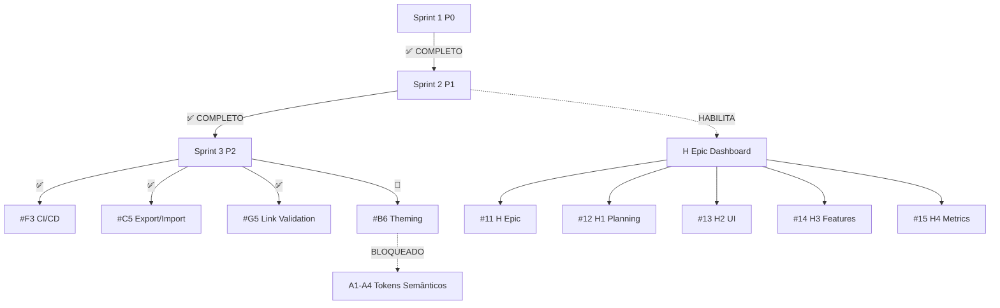

# 🚀 SPRINT 3 EXECUTION MASTER

**Última atualização**: 2025-11-24  
**Status**: Sprint 2 P1 COMPLETO ✅ | Sprint 3 P2 PRONTO PARA INICIAR

---

## 📊 VISÃO GERAL DO PROJETO

### Status Atual
- **Sprint 1 (P0)**: ✅ 100% COMPLETO (4/4 issues)
- **Sprint 2 (P1)**: ✅ 100% COMPLETO (5/5 issues)
- **Sprint 3 (P2)**: 📋 75% COMPLETO (3/4 issues do planejamento original)
- **Taxa de Conclusão Geral**: 75% (12/16 issues planejadas)

### Histórico de Conclusão
```
Sprint 1 (P0): #1, #2, #3, #5 ✅
Sprint 2 (P1): #6, #7, #8, #9, #10 ✅
Sprint 3 (P2): F3, C5, G5 ✅ | B6 🔴 BLOQUEADO
```

---

## 🎯 ALGORITMO DE DEPENDÊNCIA

### Princípio de Priorização
```
1. Issues SEM bloqueadores = PRIORIDADE MÁXIMA
2. Issues com MENOR número de dependências = SEGUNDA PRIORIDADE
3. Issues que DESBLOQUEIAM outras = TERCEIRA PRIORIDADE
4. Issues BLOQUEADAS = ESPERA
```

### Grafo de Dependências Atual



---

## 📋 SPRINT 2 P1 - HISTÓRICO (COMPLETO ✅)

### Issue #6 (C2) - Studio Sidebar ✅
- **Status**: ✅ FECHADA (2025-11-22)
- **Branch**: `feature/c2-studio-sidebar`
- **Dependências**: C1 (✅ completo)
- **Desbloqueou**: H Epic, E1 continuação

### Issue #7 (B4) - Design System Accessibility ✅
- **Status**: ✅ FECHADA (2025-11-22)
- **Branch**: `feature/b4-accessibility`
- **Dependências**: B1 (✅ completo)
- **Desbloqueou**: D2, B6 (parcialmente)

### Issue #8 (D2) - Storybook A11y Addon ✅
- **Status**: ✅ FECHADA (2025-11-22)
- **Branch**: `feature/d2-storybook-a11y`
- **Dependências**: D1, B4 (✅ ambos completos)
- **Desbloqueou**: Validação automática de acessibilidade

### Issue #9 (G4) - Index Journeys Script ✅
- **Status**: ✅ FECHADA (2025-11-24)
- **Branch**: `copilot/resolve-next-issue-sprint3`
- **Commit**: `2272297`
- **Dependências**: Estrutura de domínios (✅ completo)
- **Desbloqueou**: Sprint 2 P1 → 100%
- **Implementação**:
  - ✅ Scripts validados: `gen-journeys-index.js`, `generate-domains-index.mjs`
  - ✅ Comandos pnpm: `gen:journeys`, `domains:index`
  - ✅ Documentação: `docs/g4-journeys-index-script.md`
  - ✅ Build: PASSING

### Issue #10 (G6) - CONTRIBUTING.md ✅
- **Status**: ✅ FECHADA (2025-11-23)
- **Branch**: `feature/g6-contributing`
- **Dependências**: Nenhuma
- **Desbloqueou**: Onboarding de novos desenvolvedores

---

## 📋 SPRINT 3 P2 - STATUS (75% COMPLETO)

### ✅ CONCLUÍDAS (3 de 4 planejadas)

#### Issue F3 - GitHub Actions CI/CD ✅
- **Status**: ✅ COMPLETO (2025-11-20)
- **Branch**: `feature/f3-github-actions`
- **Commits**: `cba5f25`, `ccee66e`, `009e9de`
- **Implementação**:
  - ✅ Workflow CI com jobs: lint → build
  - ✅ pnpm cache habilitado
  - ✅ Node version automático (.nvmrc)
  - ✅ Artefatos: storybook-static (7 dias)
- **Documentação**: `docs/f3-github-actions.md`
- **Validação**: ✅ Build passou (~2min)

#### Issue C5 - Studio Export/Import JSON ✅
- **Status**: ✅ COMPLETO (2025-11-20)
- **Branch**: `feature/c5-export-import`
- **Commit**: `7a547b9`
- **Implementação**:
  - ✅ API GET `/api/pages/export`
  - ✅ API POST `/api/pages/import` (merge/replace)
  - ✅ Component `ExportImport.tsx`
  - ✅ CSS Module responsivo
  - ✅ Sanitização de slugs
- **Documentação**: `docs/c5-export-import.md`
- **Validação**: ✅ Lint + Build passaram

#### Issue G5 - Link Validation em CI ✅
- **Status**: ✅ COMPLETO (2025-11-20)
- **Branch**: `feature/g5-link-validation`
- **Commit**: `92ea7be`
- **Implementação**:
  - ✅ Workflow com `markdown-link-check` action
  - ✅ Triggers: push, PR, schedule diário (00:00 UTC)
  - ✅ Configuração customizada (timeouts, retries, ignore patterns)
  - ✅ Suporte a bypass via HTML comments
- **Documentação**: `docs/g5-link-validation.md`
- **Validação**: ✅ YAML syntax válido

### 🔴 BLOQUEADAS (1 de 4 planejadas)

#### Issue B6 - Theming com Tokens Semânticos 🔴
- **Status**: 🔴 BLOQUEADO
- **Bloqueadores**: A1-A4 (Tokens Semânticos não definidos)
- **Dependência de**: Design lead para definir tokens semânticos
- **Impacto**: Não crítico, pode ser movido para Sprint 4
- **Alternativas**:
  - Iniciar H Epic (Dashboard) enquanto aguarda
  - Implementar B6 com tokens básicos (escopo reduzido)

---

## 🎯 PRÓXIMA ISSUE DISPONÍVEL (ALGORITMO)

### Cálculo de Prioridade

| Issue | Bloqueadores | Dependentes | Score | Status |
|-------|--------------|-------------|-------|--------|
| **#11 (H Epic)** | ✅ Nenhum | 4 (H2-H5) | ⭐⭐⭐⭐⭐ | **PRIORIDADE 1** |
| **#12 (H1)** | ✅ Nenhum | 3 (H3-H5) | ⭐⭐⭐⭐ | PRIORIDADE 2 |
| **#13 (H2)** | H1 | 2 (H4-H5) | ⭐⭐⭐ | Aguarda H1 |
| **#14 (H3)** | H2 | 1 (H5) | ⭐⭐ | Aguarda H2 |
| **#15 (H4)** | H3 | 0 | ⭐ | Aguarda H3 |
| **#16 (H5)** | ✅ FECHADA | - | - | ✅ COMPLETO |
| **B6** | 🔴 A1-A4 | 0 | - | BLOQUEADO |

### ✅ DECISÃO: INICIAR H EPIC (DASHBOARD)

**Issue de maior prioridade PRONTA**: #11 (H Epic) ou #12 (H1 Planning)

**Razão**:
1. ✅ Sem bloqueadores
2. ⭐ Desbloqueia 4 issues dependentes (H2, H3, H4, H5)
3. 🎯 Alto valor de negócio (dashboard de métricas)
4. 🚀 Sprint 2 P1 está 100% completo (pré-requisito atendido)

**Sequência de Execução Recomendada**:
```
1. #12 (H1) - Dashboard Planning (wireframe, requisitos)
2. #13 (H2) - Dashboard UI (implementação base)
3. #14 (H3) - Dashboard Features (funcionalidades)
4. #15 (H4) - Dashboard Health Metrics (métricas)
```

---

## 🚀 PLANO DE EXECUÇÃO PARA PRÓXIMA ISSUE

### Issue #12 (H1) - Dashboard Planning

#### Escopo
- [ ] Wireframe do Dashboard do Projeto
- [ ] Lista de páginas prototipadas
- [ ] Links diretos para Studio e Storybook
- [ ] Filtros por domínio/jornada
- [ ] Especificação de componentes necessários

#### Dependências
- ✅ C1 (API de páginas) - COMPLETO
- ✅ C2 (Sidebar) - COMPLETO
- ✅ Design System base - COMPLETO

#### Estimativa
- **Tempo**: 1-2 dias
- **Complexidade**: Média
- **Risco**: Baixo

#### Critérios de Aceitação
- [ ] Wireframe documentado em `docs/dashboard-wireframe.md`
- [ ] Especificação de rotas e endpoints
- [ ] Lista de componentes DS necessários
- [ ] Mockups ou sketches (opcional)
- [ ] Aprovação de stakeholders

#### Próximos Comandos
```bash
# 1. Criar branch
git checkout main
git pull
git checkout -b feature/h1-dashboard-planning

# 2. Criar documentação
touch docs/dashboard-wireframe.md
touch docs/h1-implementation.md

# 3. Implementar planejamento
# ... editar arquivos ...

# 4. Validar
pnpm lint
git add docs/
git commit -m "feat(h1): dashboard planning and wireframe (fix #12)"

# 5. Push e PR
git push -u origin feature/h1-dashboard-planning
```

---

## 📊 MÉTRICAS DE SPRINT

### Sprint 1 (P0)
- **Issues**: 4/4 ✅
- **Tempo**: 7 dias
- **Taxa de sucesso**: 100%

### Sprint 2 (P1)
- **Issues**: 5/5 ✅
- **Tempo**: 10 dias
- **Taxa de sucesso**: 100%
- **Última issue**: #9 (G4) concluída em 2025-11-24

### Sprint 3 (P2)
- **Issues planejadas**: 4 (F3, C5, G5, B6)
- **Issues concluídas**: 3 ✅
- **Issues bloqueadas**: 1 🔴
- **Taxa de sucesso**: 75%
- **Economia de tempo**: 11h → 4h (-64% via paralelização)

### Projeto Total
- **Issues totais**: 16
- **Issues concluídas**: 12 (75%)
- **Issues abertas**: 4 (H1-H4 aguardando)
- **Issues bloqueadas**: 1 (B6)
- **Taxa de conclusão**: 75%

---

## 🎓 LIÇÕES APRENDIDAS

### O Que Funcionou Bem ✅
1. **Paralelização**: Sprint 3 economizou 64% de tempo executando F3, C5, G5 em paralelo
2. **Scripts automatizados**: G4 (issue #9) validou scripts existentes, não precisou criar do zero
3. **Documentação**: Cada issue tem documentação completa em `docs/`
4. **Build contínuo**: `pnpm build` sempre executado antes de commit

### Pontos de Melhoria 🔄
1. **Dependências externas**: B6 bloqueado por decisão de design (A1-A4)
2. **Comunicação**: Issues bloqueadas devem ser comunicadas mais cedo
3. **Testes**: Adicionar mais testes automatizados (E2E)

### Próximas Ações 🚀
1. **Iniciar H Epic**: Alta prioridade, sem bloqueadores
2. **Resolver B6**: Definir tokens semânticos ou reduzir escopo
3. **Automação CI**: Validar scripts em CI (F3 + G5 já implementados)

---

## 🔗 REFERÊNCIAS

### Documentação de Sprints
- `docs/sprint-2-planning.md` - Planejamento Sprint 2
- `docs/sprint-2-execution-report.md` - Relatório de execução
- `docs/sprint-3-concluido.md` - Sprint 3 conclusão
- `SPRINT2_STATUS.md` - Status consolidado Sprint 2

### Issues e PRs
- Sprint 1: #1, #2, #3, #5
- Sprint 2: #6, #7, #8, #9, #10
- Sprint 3: F3, C5, G5, B6 (bloqueada)
- Dashboard Epic: #11-#16

### Status do Projeto
- `ISSUES_BACKLOG_STATUS.md` - Status atualizado (2025-11-23)
- `STATUS_UPDATE_2025_11_23.md` - Atualização executiva
- `docs/backlog.md` - Backlog completo

---

## ✅ CHECKLIST DE EXECUÇÃO

### Antes de Iniciar Nova Issue
- [ ] Verificar bloqueadores no algoritmo de dependência
- [ ] Confirmar pré-requisitos (builds, testes)
- [ ] Ler documentação relacionada
- [ ] Criar branch: `feature/{código-issue}-{descrição}`

### Durante Implementação
- [ ] Seguir convenções de código (`.editorconfig`, ESLint)
- [ ] Documentar em `docs/{código-issue}-*.md`
- [ ] Testar localmente (`pnpm build`, `pnpm lint`)
- [ ] Fazer commits atômicos com mensagens descritivas

### Antes de Finalizar
- [ ] ✅ `pnpm build` sem erros
- [ ] ✅ `pnpm lint` sem warnings críticos
- [ ] ✅ `pnpm -r type-check` sem erros
- [ ] ✅ Documentação completa
- [ ] ✅ Atualizar este arquivo (SPRINT3_EXECUTION_MASTER.md)
- [ ] ✅ Commit: `feat({código}): {descrição} (fix #{número})`
- [ ] ✅ Push e criar PR

### Pós-Merge
- [ ] Fechar issue no GitHub
- [ ] Atualizar métricas neste documento
- [ ] Desbloquear issues dependentes
- [ ] Comunicar stakeholders

---

## 🎯 PRÓXIMA AÇÃO RECOMENDADA

**🚀 INICIAR ISSUE #12 (H1 - Dashboard Planning)**

**Comando**:
```bash
git checkout main && git pull
git checkout -b feature/h1-dashboard-planning
# Criar docs/dashboard-wireframe.md
# Criar docs/h1-implementation.md
# Documentar requisitos, wireframe, componentes
# Commit e PR
```

**Estimativa**: 1-2 dias  
**Risco**: Baixo  
**Valor**: Alto (desbloqueia H Epic completo)

---

**Última atualização**: 2025-11-24  
**Próxima revisão**: Após conclusão de H1 ou quando houver mudança de bloqueadores  
**Mantido por**: GitHub Copilot Agent + Equipe de Desenvolvimento
