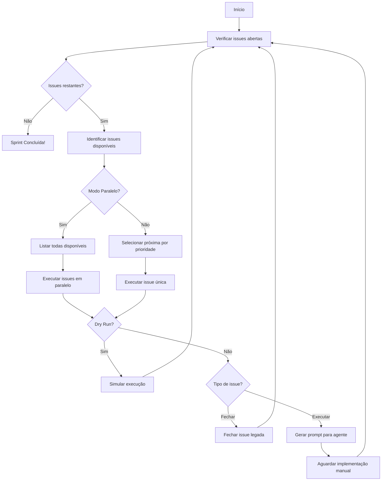

# Sprint 3 Auto-Executor - Guia Completo

## 📋 Visão Geral

O `execute-sprint3.ps1` é um script PowerShell automatizado para gerenciar e executar issues do Sprint 3 seguindo um grafo de dependências. Ele analisa dependências entre issues, determina a ordem ideal de execução, e gera prompts para agentes customizados (DevOps ou FullStack) executarem as implementações.

## 🎯 Características Principais

### 1. **Resolução Automática de Dependências**
- Analisa o grafo de dependências configurado
- Identifica issues prontas para execução (sem dependências bloqueadoras)
- Previne deadlocks e ciclos de dependência

### 2. **Modos de Execução**

#### Modo Sequencial (Padrão)
- Executa uma issue por vez
- Ordem determinada por prioridade e esforço
- Ideal para desenvolvimento focado

```powershell
.\scripts\execute-sprint3.ps1
```

#### Modo Paralelo
- Executa todas as issues disponíveis simultaneamente
- Maximiza eficiência em grafos com múltiplos caminhos independentes
- Reduz tempo total de execução

```powershell
.\scripts\execute-sprint3.ps1 -Parallel
```

### 3. **Dry Run (Simulação)**
- Testa o script sem fazer alterações reais
- Simula fechamento de issues e execução de tarefas
- Útil para validar o grafo de dependências

```powershell
.\scripts\execute-sprint3.ps1 -DryRun
```

### 4. **Seleção Inteligente de Agente**
O script analisa o título e corpo da issue para determinar qual agente customizado usar:

- **DevOps Agent**: Para CI/CD, GitHub Actions, workflows, pipelines, deploy
- **FullStack Agent**: Para componentes, APIs, UI, jornadas, dashboard, studio, Puck

### 5. **Geração de Relatórios**
Cria relatórios Markdown detalhados com:
- Timeline de execução
- Issues concluídas e falhadas
- Log de operações
- Visualização do grafo de dependências
- Estatísticas de tempo e performance

## 🚀 Como Usar

### Pré-requisitos

1. **PowerShell 7+**
   ```powershell
   $PSVersionTable.PSVersion
   ```

2. **GitHub CLI (gh)**
   ```bash
   # Instalar: https://cli.github.com/
   gh --version
   
   # Autenticar
   gh auth login
   ```

3. **Repositório clonado**
   ```bash
   git clone https://github.com/fabioaap/Ambiente-de-prototipa-o-EDUCACROSS-V2.git
   cd Ambiente-de-prototipa-o-EDUCACROSS-V2
   ```

### Execução Básica

```powershell
# Modo sequencial padrão
.\scripts\execute-sprint3.ps1

# Simulação (dry run)
.\scripts\execute-sprint3.ps1 -DryRun

# Modo paralelo
.\scripts\execute-sprint3.ps1 -Parallel

# Modo paralelo + dry run
.\scripts\execute-sprint3.ps1 -Parallel -DryRun

# Especificar caminho do relatório
.\scripts\execute-sprint3.ps1 -ReportPath "reports/sprint3-$(Get-Date -Format 'yyyyMMdd-HHmmss').md"

# Configurar número máximo de tentativas
.\scripts\execute-sprint3.ps1 -MaxRetries 5
```

### Parâmetros

| Parâmetro | Tipo | Padrão | Descrição |
|-----------|------|--------|-----------|
| `-DryRun` | Switch | `$false` | Simula execução sem fazer alterações reais |
| `-Parallel` | Switch | `$false` | Habilita execução paralela de issues independentes |
| `-ReportPath` | String | `sprint3-execution-report.md` | Caminho para salvar o relatório |
| `-MaxRetries` | Int | `3` | Número máximo de tentativas para operações que falham |

## 📊 Estrutura do Grafo de Dependências

O script usa um grafo configurado internamente:

```powershell
$issueGraph = @{
    # Issues Sprint 3 Principais
    "59" = @{ Title = "Puck Refactor"; DependsOn = @(); Priority = 1; Effort = 2.5 }
    "56" = @{ Title = "BackOffice Jornada"; DependsOn = @(); Priority = 1; Effort = 5 }
    "53" = @{ Title = "Dashboard API"; DependsOn = @("59"); Priority = 2; Effort = 2 }
    "54" = @{ Title = "Dashboard UI"; DependsOn = @("53"); Priority = 2; Effort = 3 }
    
    # Issues legadas para fechar
    "4"  = @{ Title = "Epic BackOffice Old"; DependsOn = @("56"); Priority = 3; Effort = 0; Action = "close" }
}
```

### Campos do Grafo

- **Title**: Nome descritivo da issue
- **DependsOn**: Array de números de issues das quais esta depende
- **Priority**: Prioridade de execução (1 = alta, 2 = média, 3 = baixa)
- **Effort**: Esforço estimado em horas
- **Action** (opcional): Ação especial (`"close"` para issues legadas)

## 🔄 Fluxo de Execução



## 📝 Exemplo de Prompt Gerado

Quando uma issue está pronta para execução, o script gera um prompt formatado:

```
ISSUE #53: Dashboard API

CONTEXTO:
Implementar API REST para listar páginas criadas no Studio.

Endpoints:
- GET /api/pages - Lista todas as páginas
- GET /api/pages/:id - Detalhes de uma página

REQUISITOS DE IMPLEMENTAÇÃO:
1. ✅ Implemente TODAS as funcionalidades descritas na issue acima
2. ✅ Siga os padrões do repositório (veja .github/copilot-instructions.md)
3. ✅ Execute validações: pnpm build && pnpm lint && pnpm -r type-check
4. ✅ Adicione testes se aplicável (seguindo padrões existentes)
5. ✅ Atualize documentação relevante
6. ✅ Use report_progress para commitar: "feat(#53): Dashboard API (fix #53)"
7. ✅ Execute code_review e codeql_checker antes de finalizar

PRIORIDADE: 2
ESFORÇO ESTIMADO: 2 horas

EXECUTE A IMPLEMENTAÇÃO COMPLETA AGORA.
```

## 📄 Formato do Relatório

O relatório gerado contém:

### 1. Cabeçalho
- Data/hora de geração
- Modo de execução (real/dry run)
- Execução paralela (habilitada/desabilitada)
- Tempo total de execução

### 2. Resumo
- Issues concluídas
- Issues falhadas
- Total de operações

### 3. Issues Concluídas
Lista de issues que foram executadas com sucesso

### 4. Issues Falhadas
Lista de issues que falharam com mensagem de erro

### 5. Log de Execução
Tabela detalhada com:
- Timestamp
- Número da issue
- Status
- Duração em segundos
- Agente utilizado
- Mensagem de erro (se houver)

### 6. Grafo de Dependências
Visualização textual das dependências entre issues

## 🔧 Troubleshooting

### Erro: "GitHub CLI (gh) não encontrado"

**Solução**:
```bash
# Instalar gh CLI
# Windows (winget)
winget install --id GitHub.cli

# macOS (Homebrew)
brew install gh

# Linux (apt)
sudo apt install gh

# Autenticar
gh auth login
```

### Erro: "Falha ao listar issues"

**Causas possíveis**:
1. Não autenticado no GitHub CLI
2. Sem permissões no repositório
3. Problema de rede

**Soluções**:
```powershell
# Verificar autenticação
gh auth status

# Re-autenticar
gh auth login

# Verificar repositório
gh repo view
```

### Deadlock Detectado

Se o script detecta que nenhuma issue está disponível mas ainda há issues abertas:

1. **Verifique dependências circulares**: Issue A depende de B, e B depende de A
2. **Verifique issues externas**: Dependências de issues que não estão no grafo
3. **Execute em modo dry run** para ver o que está bloqueando:
   ```powershell
   .\scripts\execute-sprint3.ps1 -DryRun
   ```

### Performance Lenta

Para sprints com muitas issues paralelas:

1. Use o modo paralelo: `-Parallel`
2. Reduza o delay entre iterações (edite o script)
3. Use uma máquina com melhor conectividade

## 🎓 Casos de Uso

### Caso 1: Execução Completa do Sprint

```powershell
# 1. Primeiro, simule para validar
.\scripts\execute-sprint3.ps1 -DryRun

# 2. Execute em modo paralelo para velocidade
.\scripts\execute-sprint3.ps1 -Parallel

# 3. Quando pausar, execute os prompts gerados
# (copie e cole no chat com o agente apropriado)

# 4. Após conclusão de cada issue, re-execute
.\scripts\execute-sprint3.ps1 -Parallel
```

### Caso 2: Debug de Dependências

```powershell
# Execute dry run e analise o relatório
.\scripts\execute-sprint3.ps1 -DryRun -ReportPath "debug-deps.md"

# Abra o relatório e verifique o grafo
code debug-deps.md
```

### Caso 3: Execução Focada (Sequencial)

```powershell
# Para trabalhar em uma issue por vez
.\scripts\execute-sprint3.ps1

# O script pausará após cada issue para implementação
```

## 🛠️ Extensões e Customizações

### Adicionar Nova Issue ao Grafo

Edite o script e adicione no `$issueGraph`:

```powershell
"100" = @{
    Title = "Nova Feature"
    DependsOn = @("53", "54")  # Depende das issues 53 e 54
    Priority = 1                # Alta prioridade
    Effort = 3                  # 3 horas estimadas
}
```

### Customizar Seleção de Agente

Edite a função `Get-AgentForIssue`:

```powershell
function Get-AgentForIssue {
    param($Issue, $IssueBody)
    
    $title = $Issue.Title.ToLower()
    $body = $IssueBody.ToLower()
    
    # Adicione novos padrões
    if ($title -match "security|vulnerability|cve") {
        return "Security"
    }
    
    # Padrões existentes...
}
```

### Adicionar Novo Agente

1. Adicione detecção em `Get-AgentForIssue`
2. Atualize `Build-AgentPrompt` para incluir instruções específicas do agente
3. Documente o novo agente neste guia

## 📚 Referências

- **Copilot Instructions**: `.github/copilot-instructions.md`
- **Sprint 3 Quick Start**: `SPRINT3_QUICK_START.md`
- **Sprint 3 Status**: `SPRINT-3-STATUS.txt`
- **Python Auto Executor**: `scripts/sprint3_auto_executor.py`

## 📞 Suporte

Para problemas ou dúvidas:

1. Verifique os logs do script
2. Consulte o relatório gerado
3. Execute em modo dry run para diagnóstico
4. Abra uma issue no repositório com:
   - Comando executado
   - Saída do erro
   - Relatório gerado (se disponível)

---

**Versão**: 2.0 (Enhanced)  
**Última Atualização**: 2025-11-24  
**Autor**: EDUCACROSS Team
