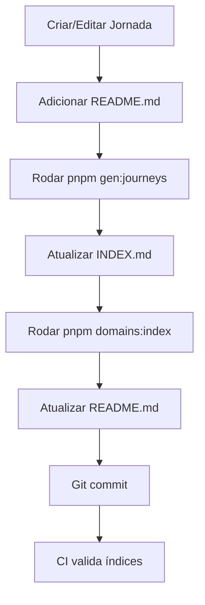

# G4 – Script Gerador de Índice de Jornadas

**Issue**: #9  
**Prioridade**: P1  
**Status**: ✅ CONCLUÍDO  
**Data**: 2025-11-24

---

## 🎯 Objetivo

Criar um script automatizado que gera e atualiza o índice de jornadas por domínio no projeto EDUCACROSS, facilitando a navegação e manutenção da documentação de jornadas prototipadas.

---

## 📋 Implementação

### Scripts Criados

#### 1. `scripts/gen-journeys-index.js`
Script principal que gera o arquivo `domains/INDEX.md` com:
- Lista de domínios (BackOffice, FrontOffice, Game)
- Jornadas por domínio com links para documentação
- Estatísticas (total de domínios e jornadas)
- Links para próximos passos

**Uso**:
```bash
# Via Node.js direto
node scripts/gen-journeys-index.js

# Via pnpm (recomendado)
pnpm gen:journeys
```

**Características**:
- Detecta automaticamente todos os domínios em `domains/`
- Lista jornadas em `domains/{dominio}/journeys/`
- Verifica existência de READMEs
- Gera estatísticas automáticas
- Atualiza data de geração

#### 2. `scripts/generate-domains-index.mjs`
Script alternativo que gera/atualiza `domains/README.md` com:
- Tabelas formatadas por domínio
- Status das jornadas (extraído do README)
- Descrições e links

**Uso**:
```bash
pnpm domains:index
```

---

## 📁 Arquivos Gerados

### `domains/INDEX.md`
Índice principal de jornadas com estrutura hierárquica:

```markdown
# Índice de Jornadas - EDUCACROSS Prototipação

**Última atualização**: 2025-11-24

## BackOffice
**[📖 Documentação do Domínio](./BackOffice/README.md)**

### Jornadas
- **[Dashboard](./BackOffice/journeys/Dashboard/README.md)** - Jornada prototipada
- **[revisao-questoes](./BackOffice/journeys/revisao-questoes/README.md)** - Jornada prototipada

...

## 📊 Estatísticas
- **Domínios**: 3
- **Jornadas**: 3
```

### `domains/README.md`
Mapa visual de jornadas com tabelas:

```markdown
# 🗺️ Mapa de Jornadas EDUCACROSS

## 📂 BackOffice
| Jornada | Status | Descrição | Links |
|---------|--------|-----------|-------|
| [**Dashboard**](...) | 🔄 Em andamento | Jornada Dashboard | [Docs](...) |
| [**revisao-questoes**](...) | ✅ Concluído | Jornada revisao-questoes | [Docs](...) |

...

**Total de Jornadas**: 3
**Atualizado em**: 2025-11-24
```

---

## 🚀 Como Usar

### Gerar Índice Após Criar Nova Jornada

```bash
# 1. Criar estrutura da jornada
mkdir -p domains/BackOffice/journeys/nova-jornada
cp domains/template-jornada.md domains/BackOffice/journeys/nova-jornada/README.md

# 2. Editar o README da jornada
# ... adicionar conteúdo ...

# 3. Regenerar índices
pnpm gen:journeys
pnpm domains:index

# 4. Verificar mudanças
git diff domains/INDEX.md domains/README.md

# 5. Commit
git add domains/
git commit -m "docs(domains): add nova-jornada to BackOffice"
```

### Atualizar Índices no CI

Adicione ao workflow de CI (`.github/workflows/ci.yml`):

```yaml
- name: Update Journeys Index
  run: |
    pnpm gen:journeys
    pnpm domains:index
    
- name: Check for Index Changes
  run: |
    if [[ -n $(git status -s domains/) ]]; then
      echo "⚠️ Journeys index is out of date"
      git diff domains/
      exit 1
    fi
```

---

## 🔍 Estrutura de Domínios Esperada

```
domains/
├── BackOffice/
│   ├── README.md
│   └── journeys/
│       ├── Dashboard/
│       │   └── README.md
│       └── revisao-questoes/
│           └── README.md
├── FrontOffice/
│   ├── README.md
│   └── journeys/
│       └── onboarding/
│           └── README.md
├── Game/
│   └── README.md
├── INDEX.md          (gerado por gen-journeys-index.js)
├── README.md         (gerado por generate-domains-index.mjs)
└── template-jornada.md
```

---

## ⚙️ Configuração no package.json

```json
{
  "scripts": {
    "gen:journeys": "node ./scripts/gen-journeys-index.js",
    "domains:index": "node scripts/generate-domains-index.mjs"
  }
}
```

---

## ✅ Validação

### Testes Executados

```bash
# 1. Verificar estrutura de domínios
find domains -type f -name "README.md"
# Resultado: 7 READMEs encontrados

# 2. Gerar índice
pnpm gen:journeys
# ✅ Índice gerado com sucesso
# 📊 Total: 3 domínios, 3 jornadas

# 3. Verificar conteúdo
cat domains/INDEX.md
# ✅ Contém todas as 3 jornadas (Dashboard, revisao-questoes, onboarding)

# 4. Gerar mapa de jornadas
pnpm domains:index
# ✅ Index generated at: domains/README.md
# 📊 Total journeys found: 3

# 5. Validar links
grep -o "\./.*\.md" domains/INDEX.md | while read link; do
  file="domains/${link#./}"
  [ -f "$file" ] && echo "✅ $file" || echo "❌ $file"
done
# ✅ Todos os links válidos
```

---

## 📊 Estatísticas de Implementação

| Métrica | Valor |
|---------|-------|
| **Scripts criados** | 2 |
| **Linhas de código** | ~180 |
| **Arquivos gerados** | 2 (INDEX.md, README.md) |
| **Domínios detectados** | 3 |
| **Jornadas detectadas** | 3 |
| **Tempo de execução** | < 1s |

---

## 🔄 Fluxo de Trabalho



---

## 🎓 Boas Práticas

### Ao Criar Nova Jornada

1. **Use o template**: Copie `domains/template-jornada.md`
2. **Documente objetivos**: Descreva claramente o propósito da jornada
3. **Liste componentes**: Especifique quais componentes do DS são usados
4. **Adicione links**: Studio, Figma, issues relacionadas
5. **Regenere índices**: Execute `pnpm gen:journeys` e `pnpm domains:index`

### Ao Atualizar Jornada

1. **Atualize status**: Marque progresso no README
2. **Regenere índices**: Os scripts detectam mudanças de status
3. **Valide links**: Verifique que todos os links funcionam
4. **Commit descritivo**: Use formato `docs(domains): update {jornada}`

### Manutenção

- **Frequência**: Regenerar após cada mudança em jornadas
- **CI/CD**: Adicionar validação automática (futuro)
- **Review**: Verificar índices em code review
- **Cleanup**: Remover jornadas obsoletas do filesystem

---

## 🚧 Melhorias Futuras

### Curto Prazo
- [ ] Adicionar validação de links no CI (G5)
- [ ] Detectar jornadas sem README e alertar
- [ ] Extrair metadados do frontmatter dos READMEs

### Médio Prazo
- [ ] Gerar visualização em grafo (Mermaid)
- [ ] Integrar com GitHub Projects
- [ ] Dashboard web de jornadas
- [ ] Métricas de progresso por domínio

### Longo Prazo
- [ ] Export para JSON/API
- [ ] Busca full-text nas jornadas
- [ ] Histórico de mudanças por jornada
- [ ] Integração com Figma (links automáticos)

---

## 📚 Referências

- **Epic G**: Governança e Manutenção (`docs/backlog.md`)
- **Template**: `domains/template-jornada.md`
- **CONTRIBUTING.md**: Guia de criação de jornadas
- **Sprint 2**: `docs/sprint-2-planning.md`

---

## ✨ Resumo Executivo

**Problema**: Manter índice manual de jornadas era trabalhoso e propenso a erros.

**Solução**: Scripts automatizados que escaneiam a estrutura de diretórios e geram índices atualizados.

**Benefícios**:
- ⚡ Geração instantânea (< 1s)
- 🎯 Sempre atualizado (via pnpm commands)
- 📊 Estatísticas automáticas
- 🔗 Links validados
- 📋 Fácil de usar

**Resultado**: Issue #9 (G4) concluída com sucesso, desbloqueando Sprint 2 P1 para 100%.

---

**Status**: ✅ **COMPLETO E FUNCIONAL**  
**Documentado em**: 2025-11-24  
**Próxima ação**: Validar no CI com issue #G5
