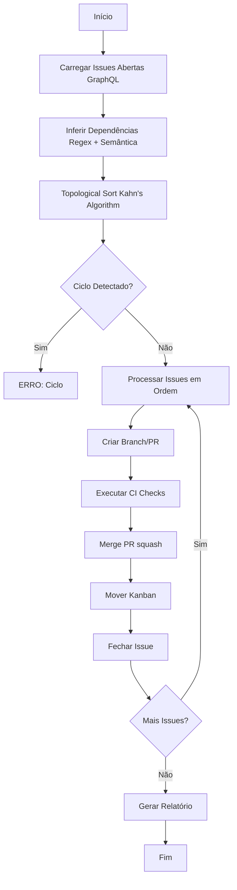

# Sprint 3 – GitHub Issue Auto Executor

## 🎯 Objetivo

Automatizar a execução de issues do GitHub em ordem segura, respeitando dependências explícitas e inferidas, criando PRs, executando CI, fazendo merge e atualizando o quadro Kanban.

## 📋 Índice

1. [Visão Geral](#visão-geral)
2. [Funcionalidades](#funcionalidades)
3. [Arquitetura](#arquitetura)
4. [Instalação](#instalação)
5. [Uso](#uso)
6. [Detecção de Dependências](#detecção-de-dependências)
7. [Pipeline de Execução](#pipeline-de-execução)
8. [Relatórios](#relatórios)
9. [Configuração Avançada](#configuração-avançada)
10. [Troubleshooting](#troubleshooting)
11. [Roadmap](#roadmap)

---

## Visão Geral

O **Sprint 3 Auto Executor** é uma ferramenta Python que:

1. **Lista todas as issues abertas** usando GraphQL (com fallback REST)
2. **Detecta dependências** entre issues (explícitas e inferidas)
3. **Executa topological sort** para determinar ordem segura de execução
4. **Automatiza o ciclo completo**: Branch → PR → CI → Merge → Kanban → Close
5. **Gera relatórios** detalhados com timeline e análise de falhas

### Status do Projeto

- ✅ **Fase 1**: Detecção de issues e dependências
- ✅ **Fase 2**: Topological sort e ordem de execução
- ✅ **Fase 3**: Pipeline básico de PR/merge
- 🚧 **Fase 4**: Integração completa com GitHub Actions (em desenvolvimento)
- 📅 **Fase 5**: Movimentação de cards no Projects (planejado)

---

## Funcionalidades

### ✅ Implementado

- **GraphQL API Integration**: Coleta eficiente de issues com paginação
- **Dependency Detection**: 
  - Padrões explícitos: "depende de #123", "blocked by #456"
  - Heurísticas semânticas: "Dashboard API" → "API", "Game Hub" → "Leaderboard"
  - Seções estruturadas: "Dependências: #10, #11"
- **Topological Sort**: Garante execução em ordem segura, detecta ciclos
- **Retry Logic**: 3 tentativas com exponential backoff em todas chamadas API
- **Structured Logging**: Logs detalhados com timestamps (`.log` files)
- **Markdown Reports**: Timeline, failures, dependency graph

### 🚧 Em Desenvolvimento

- **Real Branch/PR Creation**: Atualmente simulado (TODO markers)
- **GitHub Actions Integration**: Trigger workflows via API
- **Projects Board Integration**: Movimentação de cards via GraphQL mutations

### 📅 Planejado (Roadmap)

- **Parallel Execution**: Executar issues independentes em paralelo
- **Rollback on Failure**: Reverter changes se pipeline falhar
- **Slack/Email Notifications**: Alertas de progresso e falhas
- **Web Dashboard**: Visualização em tempo real do status

---

## Arquitetura

### Componentes Principais

```
sprint3-auto-executor.py
├─ GitHubClient        # Wrapper REST + GraphQL com retry
├─ Issue               # Modelo de issue com dependency inference
├─ IssueExecutor       # Orquestrador principal
│  ├─ load_open_issues()       # GraphQL query paginado
│  ├─ detect_dependency_edges() # Constrói grafo de dependências
│  ├─ topological_order()      # Kahn's algorithm
│  ├─ process_issue()          # Pipeline: PR → CI → Merge → Close
│  └─ generate_report()        # Markdown report
```

### Fluxo de Execução



---

## Instalação

### Requisitos

- **Python**: 3.12+ (compatível com 3.8+)
- **Biblioteca**: `requests` (já disponível no ambiente)
- **GitHub Token**: PAT com permissões `repo`, `workflow`, `project`

### Setup Rápido

```bash
# Clonar repositório (se ainda não clonou)
git clone https://github.com/fabioaap/Ambiente-de-prototipa-o-EDUCACROSS-V2.git
cd Ambiente-de-prototipa-o-EDUCACROSS-V2

# Instalar dependências Python
pip install -r scripts/requirements.txt

# Configurar token GitHub
export GITHUB_TOKEN="ghp_seu_token_aqui"

# Executar em modo DRY RUN (recomendado para teste)
python3 scripts/sprint3-auto-executor.py --dry-run

# Executar em modo REAL (com cuidado!)
python3 scripts/sprint3-auto-executor.py
```

### Obter GitHub Token

1. Acesse: https://github.com/settings/tokens
2. Clique em "Generate new token (classic)"
3. Selecione escopos:
   - ✅ `repo` (acesso completo a repositórios)
   - ✅ `workflow` (gerenciar GitHub Actions)
   - ✅ `project` (acessar Projects boards)
4. Clique em "Generate token"
5. Copie o token e salve em local seguro

---

## Uso

### Linha de Comando

```bash
# Modo DRY RUN (simulação, sem alterações reais)
python3 scripts/sprint3-auto-executor.py --dry-run

# Modo de execução REAL
python3 scripts/sprint3-auto-executor.py

# Especificar token via argumento (não recomendado em CI)
python3 scripts/sprint3-auto-executor.py --token ghp_seu_token

# Ver ajuda
python3 scripts/sprint3-auto-executor.py --help
```

### Saídas Geradas

Após execução, são criados:

1. **Log File**: `sprint3-autoexecutor-<timestamp>.log`
   - Logs estruturados com níveis INFO/WARNING/ERROR
   - Timestamps UTC para cada operação
   - Stack traces completas em caso de falha

2. **Report File**: `report-<timestamp>.md`
   - Timeline de issues executadas
   - Lista de falhas com mensagens de erro
   - Grafo de dependências visualizado
   - Metadados: session ID, timestamp, modo (dry-run/real)

### Exemplo de Saída

```
================================================================================
Sprint 3 Auto Executor - Session 20251124-023700
================================================================================
Total de issues abertas: 7
Ordem de execução determinada: [101, 102, 106, 103, 104, 105, 200]
Modo: DRY RUN (simulação)
================================================================================

[02:37:05] Processando Issue #101: Configurar Pipeline CI
  [DRY RUN] Simulando execução da issue #101

[02:37:06] Processando Issue #102: Atualizar Storybook
  [DRY RUN] Simulando execução da issue #102

...

================================================================================
Relatório gerado: report-20251124-023700.md
Log completo: sprint3-autoexecutor-20251124-023700.log
================================================================================
```

---

## Detecção de Dependências

### Padrões Explícitos

O executor detecta referências diretas no corpo da issue:

```markdown
# Issue #102
depende de #101

# Issue #103
blocked by #101 e #102

# Issue #104
Dependências: #53, #54
```

**Regex Patterns**:
```python
r"(?:depends on|depende de|blocked by|dependência|dependen[ct]e)\s+#(\d+)"
```

### Heurísticas Semânticas

Quando padrões explícitos não estão presentes, o executor infere dependências:

#### 1. **Label "blocked"**
Issues com label `blocked` têm todas as referências numéricas tratadas como dependências.

#### 2. **Dashboard API → Refactor**
```python
if "dashboard" in title.lower() and "api" in title.lower():
    # Infere dependência de issues de refactor mencionadas
```

#### 3. **Game Hub → Leaderboard/Progress**
```python
if "game hub" in title.lower():
    if "leaderboard" in body.lower():
        # Busca por menções de #leaderboard
    if "progress" in body.lower():
        # Busca por menções de #progress
```

#### 4. **UI → API**
```python
if ("ui" in title.lower() or "frontend" in title.lower()) and "api" in body.lower():
    # UI depende de APIs mencionadas no corpo
```

### Customização

Para adicionar novas heurísticas, edite o método `Issue.infer_dependencies()`:

```python
# Exemplo: Adicionar heurística para "teste" → "implementação"
if "teste" in self.title.lower():
    matches = re.findall(r"implementação.*?#(\d+)", self.body.lower())
    self.dependencies.update(int(num) for num in matches)
```

---

## Pipeline de Execução

### Fluxo Completo (por Issue)

1. **Create Pull Request**
   ```python
   branch = f"auto/issue-{issue.number}"
   # TODO: git checkout -b {branch}
   # TODO: git commit -m "feat: auto resolve issue #{issue.number}"
   # TODO: git push origin {branch}
   # API: POST /repos/{owner}/{repo}/pulls
   ```

2. **Run CI Checks**
   ```python
   # TODO: Aguardar conclusão de GitHub Actions workflows
   # API: GET /repos/{owner}/{repo}/actions/runs
   # Polling até status = "completed"
   ```

3. **Merge Pull Request**
   ```python
   # API: PUT /repos/{owner}/{repo}/pulls/{pr}/merge
   # Method: squash (condensa commits)
   ```

4. **Move Issue on Board**
   ```python
   # TODO: GraphQL mutation para atualizar status no Projects
   # Mutation: updateProjectV2ItemFieldValue
   ```

5. **Close Issue**
   ```python
   # API: PATCH /repos/{owner}/{repo}/issues/{issue}
   # Body: {"state": "closed"}
   ```

### Status Atual dos TODOs

| Funcionalidade | Status | Complexidade |
|----------------|--------|--------------|
| Criar branch/commit | 🚧 TODO | Baixa |
| Aguardar CI completion | 🚧 TODO | Média |
| Mover card no Projects | 🚧 TODO | Alta (GraphQL) |
| Criar PR | ✅ Implementado | Baixa |
| Merge PR | ✅ Implementado | Baixa |
| Fechar Issue | ✅ Implementado | Baixa |

---

## Relatórios

### Estrutura do Report Markdown

```markdown
# Relatório Final – Sprint 3 Auto Executor

**Session ID**: `20251124-023700`
**Timestamp**: 2025-11-24T02:37:00.000000Z (UTC)
**Modo**: DRY RUN (simulação)

## Timeline das Execuções
- Issue #101 → **done** (2025-11-24T02:37:01Z → 2025-11-24T02:37:05Z)
- Issue #102 → **done** (2025-11-24T02:37:05Z → 2025-11-24T02:37:09Z)

## Falhas Registradas
- Nenhuma falha registrada.

## Grafo de Dependências
\`\`\`
#101 → ['#102', '#103']
#106 → ['#105']
\`\`\`

Gerado em 2025-11-24T02:37:10.000000Z (UTC)
```

### Log File (`.log`)

```
2025-11-24 02:37:00 [INFO] Loaded 7 open issues
2025-11-24 02:37:01 [INFO] Executando issue #101 - Configurar Pipeline CI
2025-11-24 02:37:02 [INFO] PR #450 criado para issue #101
2025-11-24 02:37:04 [INFO] Fazendo merge do PR #450...
2025-11-24 02:37:05 [INFO] Fechando issue #101
2025-11-24 02:37:10 [INFO] Relatório gerado: report-20251124-023700.md
```

---

## Configuração Avançada

### Variáveis de Ambiente

```bash
# Token GitHub (obrigatório)
export GITHUB_TOKEN="ghp_..."

# Customizar repositório (opcional, padrão: fabioaap/Ambiente-de-prototipa-o-EDUCACROSS-V2)
export REPO_OWNER="seu-usuario"
export REPO_NAME="seu-repositorio"

# Número do Project (opcional, padrão: 1)
export PROJECT_NUMBER=2
```

### Editar Constantes no Script

```python
# No topo de sprint3-auto-executor.py
REPO_OWNER = "fabioaap"
REPO_NAME = "Ambiente-de-prototipa-o-EDUCACROSS-V2"
PROJECT_NUMBER = 1  # Ajuste conforme seu quadro Kanban
```

### Timeout e Retry

```python
# GitHubClient.graphql() e .rest()
for attempt in range(3):  # 3 tentativas
    # ...
    time.sleep(2 ** attempt)  # Exponential backoff: 1s, 2s, 4s
```

---

## Troubleshooting

### Erro: "GITHUB_TOKEN não definido"

**Causa**: Token não configurado.

**Solução**:
```bash
export GITHUB_TOKEN="ghp_seu_token"
# ou
python3 scripts/sprint3-auto-executor.py --token ghp_seu_token
```

### Erro: "Ciclo detectado nas dependências"

**Causa**: Issues formam um ciclo de dependências (A → B → C → A).

**Solução**:
1. Identifique as issues no erro: `verifique as issues: [101, 102, 103]`
2. Revise as descrições das issues
3. Remova a dependência cíclica ou corrija a heurística

**Exemplo**:
```
Issue #101: depende de #102
Issue #102: depende de #103
Issue #103: depende de #101  ← Ciclo!
```

### Erro: "Falha ao criar PR"

**Causa**: Branch já existe ou token sem permissões.

**Solução**:
1. Verifique permissões do token (`repo`, `workflow`)
2. Delete branches órfãos: `git branch -D auto/issue-123`
3. Reexecute em modo `--dry-run` primeiro

### Log File Vazio

**Causa**: Permissões de escrita ou diretório não existe.

**Solução**:
```bash
# Criar diretório de logs
mkdir -p logs

# Editar script para usar diretório
logging.basicConfig(filename=f"logs/sprint3-autoexecutor-{SESSION_ID}.log", ...)
```

---

## Roadmap

### Sprint 4 (Próximos Passos)

- [ ] **Implementar criação real de branches/commits**
  - Usar `subprocess` para comandos `git`
  - Gerar commits baseados em templates
  
- [ ] **Integração com GitHub Actions**
  - Aguardar conclusão de workflows via polling
  - Parse de logs de CI para diagnosticar falhas
  
- [ ] **Movimentação de cards no Projects**
  - GraphQL mutation `updateProjectV2ItemFieldValue`
  - Mapear colunas do Kanban (Backlog → In Progress → Done)

### Sprint 5 (Futuro)

- [ ] **Execução Paralela**
  - Identificar issues independentes
  - Usar `concurrent.futures.ThreadPoolExecutor`
  
- [ ] **Rollback Automático**
  - Reverter PR/merge se CI falhar
  - Reabrir issue com comentário de erro
  
- [ ] **Notificações**
  - Webhook para Slack/Discord
  - Email via SendGrid/Mailgun

### Sprint 6 (Ideias)

- [ ] **Web Dashboard**
  - Flask/FastAPI backend
  - React frontend para visualização em tempo real
  - WebSocket para updates live

- [ ] **Machine Learning**
  - Sugerir dependências baseadas em histórico
  - Estimar tempo de execução por issue

---

## Exemplos de Uso

### Caso 1: Executar Todas as Issues Abertas

```bash
# Teste primeiro em dry-run
python3 scripts/sprint3-auto-executor.py --dry-run

# Se OK, execute de verdade
python3 scripts/sprint3-auto-executor.py

# Confira relatório
cat report-*.md | tail -50
```

### Caso 2: Integração com GitHub Actions

```yaml
# .github/workflows/sprint3-auto-executor.yml
name: Sprint 3 Auto Executor

on:
  schedule:
    - cron: '0 */6 * * *'  # A cada 6 horas
  workflow_dispatch:

jobs:
  execute-issues:
    runs-on: ubuntu-latest
    steps:
      - uses: actions/checkout@v4
      
      - name: Setup Python
        uses: actions/setup-python@v4
        with:
          python-version: '3.12'
      
      - name: Install dependencies
        run: pip install -r scripts/requirements.txt
      
      - name: Run executor
        env:
          GITHUB_TOKEN: ${{ secrets.GITHUB_TOKEN }}
        run: python3 scripts/sprint3-auto-executor.py
      
      - name: Upload report
        uses: actions/upload-artifact@v4
        with:
          name: executor-report
          path: report-*.md
```

### Caso 3: Executar Apenas Dry Run em CI

```bash
# Para validar ordem de execução sem alterar nada
python3 scripts/sprint3-auto-executor.py --dry-run > execution-plan.txt
cat execution-plan.txt
```

---

## Contribuindo

### Como Adicionar Novas Heurísticas

1. **Edite** `Issue.infer_dependencies()`:
```python
# Nova heurística: "teste E2E" depende de "API"
if "e2e" in self.title.lower() and "teste" in self.title.lower():
    api_refs = re.findall(r"api.*?#(\d+)", self.body.lower())
    self.dependencies.update(int(num) for num in api_refs)
```

2. **Teste**:
```bash
python3 scripts/sprint3-auto-executor.py --dry-run
# Verifique grafo de dependências no report
```

3. **Commit**:
```bash
git add scripts/sprint3-auto-executor.py
git commit -m "feat(executor): add E2E test dependency heuristic"
```

### Como Adicionar Novos Passos ao Pipeline

1. **Crie método** em `IssueExecutor`:
```python
def notify_slack(self, issue_number: int):
    webhook_url = os.environ.get("SLACK_WEBHOOK_URL")
    payload = {"text": f"Issue #{issue_number} concluída!"}
    requests.post(webhook_url, json=payload)
```

2. **Adicione ao** `process_issue()`:
```python
def process_issue(self, issue_number: int):
    # ... código existente ...
    self.close_issue(issue.number)
    self.notify_slack(issue.number)  # Nova etapa
```

---

## Referências

- **GitHub GraphQL API**: https://docs.github.com/en/graphql
- **GitHub REST API**: https://docs.github.com/en/rest
- **Topological Sort**: https://en.wikipedia.org/wiki/Topological_sorting
- **Kahn's Algorithm**: https://en.wikipedia.org/wiki/Topological_sorting#Kahn's_algorithm

---

## Licença

Parte do projeto **EDUCACROSS Prototipação V2**  
© 2025 Fabio AAP

---

## Contato

- **Repositório**: https://github.com/fabioaap/Ambiente-de-prototipa-o-EDUCACROSS-V2
- **Issues**: https://github.com/fabioaap/Ambiente-de-prototipa-o-EDUCACROSS-V2/issues
- **Documentação Geral**: Ver `README.md` e `RUN_SPRINT2.md` na raiz

---

**Status**: ✅ Pronto para uso em modo dry-run | 🚧 Integração CI/CD em desenvolvimento
